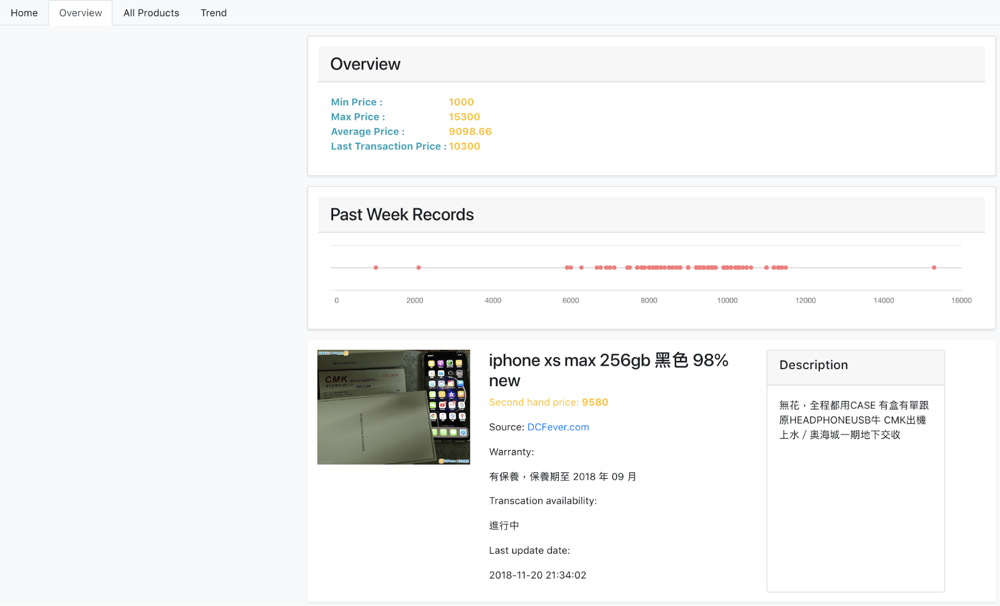
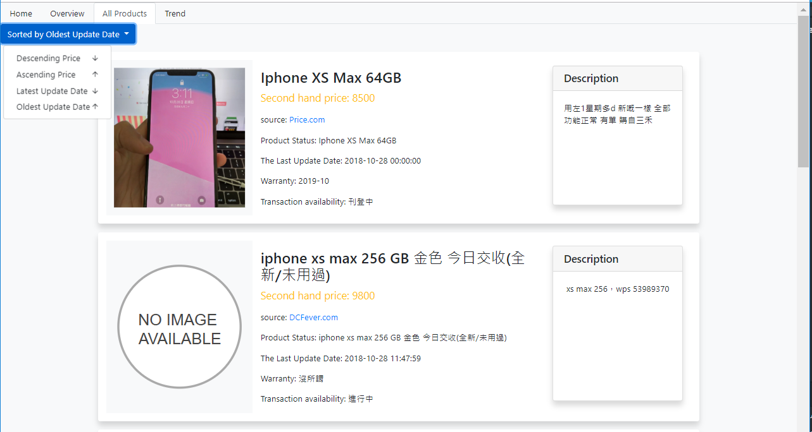
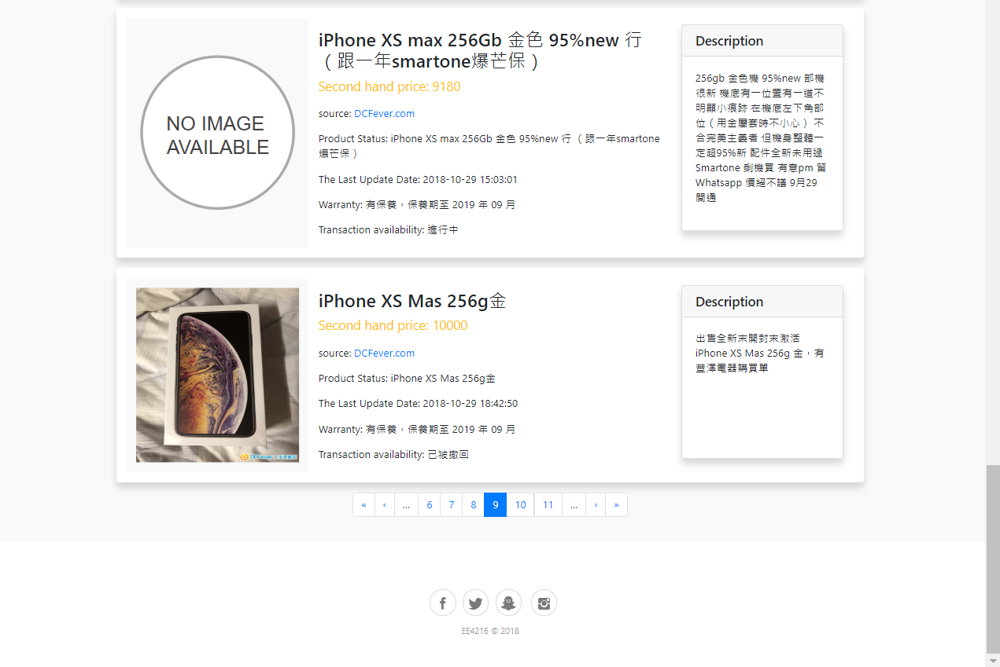
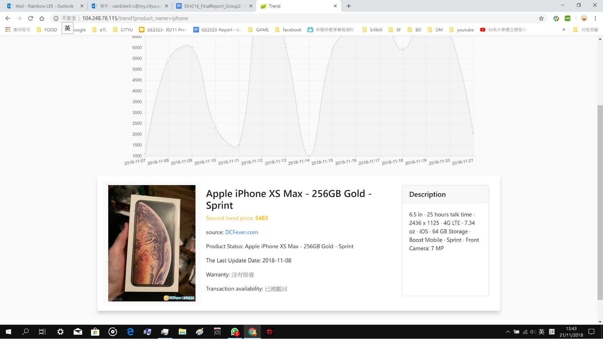

# Price Comparison on Second-Hand Gadgets

The web application is built using Vue.js and Spring Boot. It aims to collect the information of second hand electronic gadgets in HK and provide an overview for price comparison.

## Workflow

## Landing Page

## Overview Page

## All Products Page

## Pagination

## Trend Page

